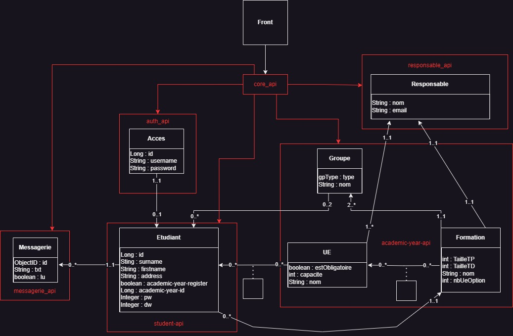

# Documentation du projet EduTrack

## Partie Schéma

### Diagramme UML de l'application


### Diagramme UML des APIs du projet


#### Les APIs que nous avons développées sont :
    - auth-api => Implémenté avec Spring
    - student-api => Implémenté avec Spring
    - messagerie-api => Implémenté avec une Servlet

---
---

## Partie structure de la BDD

Il y'a deux serveurs de SGBD pour notre projet, le serveur MongoDB (utilisée pour l'API Message) et le serveur MariaDB (utilisée pour les API Étudiant et Authentification)

### Serveur MariaDB

Sur le serveur MariaDB, nous utilisons deux bases de données

La première est `auth` qui contient la table `access` dont voici le schéma

```sql
id BIGINT(20) NOT NULL AUTO_INCREMENT, --PK
password VARCHAR(255) NOT NULL, --Mot de passe encrypté
student BIGINT(20) UNIQUE, --Numéro étudiant associé au compte ou NULL pour le compte admin
username VARCHAR(255) NOT NULL UNIQUE, --Nom d'utilisateur
PRIMARY KEY (id)
```

La seconde est `student` qui contient la table `student` dont voici le schéma

```sql
id BIGINT(20) NOT NULL AUTO_INCREMENT, --PK
academic_year_id BIGINT(20), --ID de la formation suivie
academic_year_registered BIT(1) NOT NULL DEFAULT 0, --Boolean indiquant si l'étudiant est accepté dans une formation
adress VARCHAR(255) NOT NULL, -- Adresse
courses_id VARBINARY(255), --Liste d'ID des UEs optionnelles
firstname VARCHAR(255) NOT NULL, --Prénom
surname VARCHAR(255) NOT NULL, --Nom de famille
dw INT(11), --Groupe de TD
pw INT(11), --Groupe de TP
PRIMARY KEY (id)
```

### Serveur MongoDB

Sur le serveur MongoDB, nous utilions une base nommée `main` qui contient une collection nommée `messages` dont voici le schéma

```json
{
    "_id": "ObjectId", //ID du message
    "text": "String", //Contenu du message
    "student": "Number", //Numéro de l'étudiant qui a reçu le message
    "readed": "Boolean" //Faux si non lu, vrai si lu
}
```

## Partie API REST

Nos spécifications Swagger se trouvent dans le répertoire `infos/swagger`.
Elles ont pour nom les noms des APIs que nous avons implémentés

[Swagger pour visionner les points de terminaison](https://editor.swagger.io/)

---
---

## Travail supplémentaire

Notre projet en plus des APIs que nous avions a développer contient une API développée en JavaScript

Nous avons développé cette API pour pouvoir travailler sur le front-end de manière efficace.

Elle a pour vocation de faire le travail de CoreAPI et d'inclure une version très minime de l'API formation (Les groupes et responsables sont écrites dans les lignes des schémas au lieu d'être des clés étrangères).

Elle nous permet d'avoir une réelle démonstration du projet. Nous stockons ses données sur le serveur MongoDB, nous avons fait ce choix afin de faciliter le plus possible son développement pour nous concentrer sur le front par la suite.

---
---

## L'emplacements des sources

Nos sources se trouvent:

- Dossier authapi pour l'API d'Authentification
- Dossier studentapi pour l'API Étudiant
- Dossier messagesapi pour l'API Message
- Dossier front pour l'application VueJS
- Dossier expressApi pour l'implémentation de notre version minime de CoreAPI

---
---

## Docker

Toute notre application est dockerisée pour pouvoir lancer l'application il suffit de lancer les commandes suivantes:

```bash
pnpm -C ./expressApi i #Installation dépendance de l'API Core
pnpm -C ./front i #Installation dépendance de l'application Vue
docker compose up --build #Construction des autres API et lancement
```

Le front sera accessible via l'URL: `http://localhost`

---
---

## Membres de l'Équipe

- EL OUAZIZI Walid - Développeur
- MAHIER Romain - Développeur
- DELAVILLE--DE LA PARRA Baptiste - Développeur