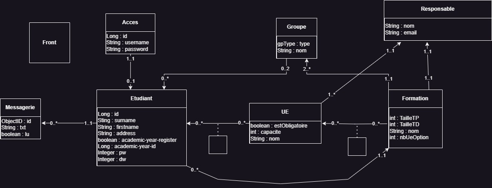

# Documentation du projet EduTrack

## Schéma

### Diagramme UML de l'application

  


### Diagramme UML des APIs du projet

  


### APIs développées

- **auth-api** → Implémenté avec Spring

- **student-api** → Implémenté avec Spring

- **messagerie-api** → Implémenté avec une Servlet


---
## Structure de la Base de Données

  Le projet utilise deux serveurs de bases de données :

- **MongoDB** (utilisé pour l'API Message)

- **MariaDB** (utilisé pour les APIs Étudiant et Authentification)

### Serveur MariaDB

Nous utilisons deux bases de données distinctes sur ce serveur : 
### Base `auth`

Cette base contient la table `access` :

```sql
CREATE TABLE access (
    id BIGINT(20) NOT NULL AUTO_INCREMENT, -- Clé primaire
    password VARCHAR(255) NOT NULL, -- Mot de passe chiffré
    student BIGINT(20) UNIQUE, -- Numéro étudiant associé au compte (NULL pour admin)
    username VARCHAR(255) NOT NULL UNIQUE, -- Nom d'utilisateur
    PRIMARY KEY (id)
);
```
### Base `student`

Cette base contient la table `student` :

```sql
CREATE TABLE student (
    id BIGINT(20) NOT NULL AUTO_INCREMENT, -- Clé primaire
    academic_year_id BIGINT(20), -- ID de la formation suivie
    academic_year_registered BIT(1) NOT NULL DEFAULT 0, -- Inscription validée ? (0/1)
    adress VARCHAR(255) NOT NULL, -- Adresse de l'étudiant
    courses_id VARBINARY(255), -- Liste d'IDs des UEs optionnelles
    firstname VARCHAR(255) NOT NULL, -- Prénom
    surname VARCHAR(255) NOT NULL, -- Nom de famille
    dw INT(11), -- Groupe de TD
    pw INT(11), -- Groupe de TP
    PRIMARY KEY (id)
);
```
### Serveur MongoDB

Le serveur MongoDB contient une base nommée `main`, avec une collection `messages` :

```json
{
    "_id": "ObjectId", // Identifiant unique du message
    "text": "String", // Contenu du message
    "student": "Number", // Numéro de l'étudiant destinataire
    "readed": "Boolean" // Message lu (true) ou non (false)
}
```
---
## API REST

Les spécifications **Swagger** des APIs sont disponibles dans le répertoire `infos/swagger`.
Elles portent les noms des APIs implémentées.

🔗 [Swagger Editor - Visualisation des endpoints](https://editor.swagger.io/)

---
## Travail Supplémentaire

En plus des APIs développées, nous avons conçu une API supplémentaire en **JavaScript**.
### Objectif de cette API

Cette API facilite le développement du front-end en jouant le rôle de **CoreAPI** allégé et en incluant une version minimale de l'API Formation.
- Les groupes et responsables sont directement renseignés dans les documents au lieu d'être des clés étrangères.

- Elle permet une démonstration fonctionnelle rapide du projet.

- Elle stocke ses données sur le serveur MongoDB pour simplifier son implémentation et se concentrer sur le front-end.
---
## Emplacement des Sources

Les fichiers sources du projet sont organisés ainsi :

- **`authapi/`** → API d'Authentification
- **`studentapi/`** → API Étudiant
- **`messagesapi/`** → API Message
- **`front/`** → Application VueJS
- **`expressApi/`** → Implémentation simplifiée de CoreAPI
---
## Architecture de nos APIs

Nous avons découpé nos APIs de manière à fonctionner en couches, pour chaque API on a:

- Une couche entités qui définit le schéma de persistance

- Une couche contrôleurs qui map les URL (Une servlet pour MessageAPI, des RestController pour les API avec Spring)

- Une couche services qui inclut une interface et son implémentation et qui gère la logique métier

- Parfois des exceptions spécifiques (APIException pour MessageAPI ou BannedTokenException pour AuthAPI)

### Spécifiques aux APIs

#### Les API avec Spring

- Couche repository pour l'accès aux données

#### AuthAPI

- Couche sécurité (Gestion de token JWT et configuration de Spring Security)

- Couche configuration qui fourni une Bean pour l'encrypter de mot de passe

- Couche DTO pour les schémas de requête et réponse HTTP

#### StudentAPI

Nous avons deux implémentations de cette API, une avec DTO une sans.
Nous rendrons probablement celle sans car selon nous la couche DTO n'a pas de grande utilité ici étant donné que les données reçus sont sensiblement les mêmes que celles envoyés et que les DTO ajoute beaucoup de charge inutile.

Par exemple pour import etudiants mapper une première fois les DTO en entités, les sauvegarder, puis les remapper en DTO
C'est en soit assez simple mais pour nous ça alourdit la tâche surtout que le DTO et l'entité sont les mêmes.

#### MessageAPI

- Une couche filtres qui nous permettait de ne pas avoir de soucis avec les headers CORS lors de nos tests

- Une couche accès qui fourni un singleton d'accès à la collection MongoDB

- Une couche configuration que nous utilisions pour afficher la stacktrace lors de la levée d'APIException

- Une couche utils qui nous permet de mapper des Message en JSON et du JSON en Message

---
## Docker
L'ensemble de l'application est **dockerisée**. Pour la déployer, exécutez les commandes suivantes :

```bash
pnpm -C ./expressApi i  # Installation des dépendances de CoreAPI
pnpm -C ./front i        # Installation des dépendances du front VueJS
docker compose up --build  # Construction et lancement des autres APIs
```

L'application front-end sera accessible à l'adresse :
🔗 `http://localhost`

---
## Membres de l'Équipe

- **EL OUAZIZI Walid** - Développeur
- **MAHIER Romain** - Développeur
- **DELAVILLE-DE LA PARRA Baptiste** - Développeur